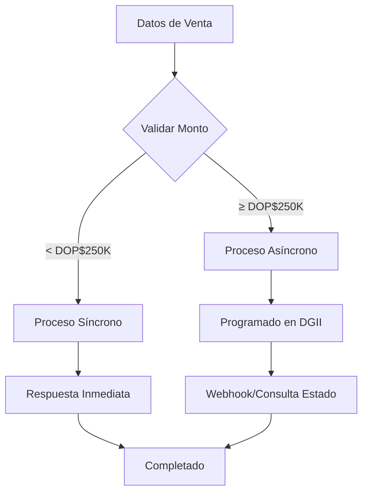

# Mejoras para Factura de Consumo Electrónica (32) - Alanube DOM

## Resumen de Mejoras Implementadas

Basado en la documentación oficial de Alanube DOM, se implementaron las siguientes mejoras específicas para **Factura de Consumo Electrónica (32)**:

### Procesamiento Síncronvo vs Asíncrono

| Monto de Factura | Tipo de Procesamiento | Límite de Ítems | RNC Comprador |
|-----------------|----------------------|------------------|---------------|
| < DOP$250,000   | Síncrono (inmediato) | 10,000 ítems    | Opcional      |
| ≥ DOP$250,000   | Asíncrono (DGII)     | 1,000 ítems     | **Obligatorio** |

### Validaciones Automáticas

#### Límites de Ítems
```php
// Factura < DOP$250,000: máximo 10,000 ítems
// Factura ≥ DOP$250,000: máximo 1,000 ítems
AlanubeDomConsumerInvoiceEnhancement::validateConsumerInvoiceLimits($request);
```

#### RNC Condicional
```php
// RNC solo obligatorio si monto ≥ DOP$250,000
$requiresRnc = AlanubeDomConsumerInvoiceEnhancement::requiresBuyerRnc($request);
$buyer = AlanubeDomConsumerInvoiceEnhancement::buildBuyerWithConditionalRnc($request, $requiresRnc);
```

#### Detección de Respuesta Asíncrona
```php
// Detectar si DGII responde con código AEP2006 (timeout)
$isAsync = AlanubeDomConsumerInvoiceEnhancement::isAsyncResponse($responseData);

// Ejemplo de respuesta asíncrona:
{
  "response": [
    {
      "message": "The connection with DGII has timed out. We have scheduled your document for automatic transmission. Check it out in a moment",
      "code": "AEP2006"
    }
  ]
}
```

### Uso desde Módulos

#### Método Recomendado
```php
use App\Utils\AlanubeDomEmissionHelper;

// Emisión automática con todas las validaciones
$result = AlanubeDomEmissionHelper::emitConsumerInvoice($organization, $saleData, $userId);

if ($result['success']) {
    if (isset($result['is_async']) && $result['is_async']) {
        // Factura enviada para procesamiento asíncrono
        // Consultar estado más tarde o activar webhooks
        echo "Documento enviado para procesamiento asíncrono";
    } else {
        // Factura procesada inmediatamente
        echo "Documento emitido exitosamente";
    }
}
```

#### Uso Directo del Servicio
```php
use App\Services\AlanubeDomService;

$service = new AlanubeDomService();

// Transformar datos Kart21 a formato Alanube DOM
$alanubeDomData = $service->transformKart21ToAlanubeFiscal(
    $organization, 
    $saleData, 
    AlanubeDomService::INVOICE // Tipo 32
);

// Emitir con validaciones específicas
$result = $service->emitConsumerInvoice($organization, $alanubeDomData);
```

### Campos Específicos Implementados

#### IdDoc (Identificación del Documento)
```php
'idDoc' => [
    'encf' => 'E32XXXXXXXXXX',  // Prefijo E32 para tipo 32
    'sequenceDueDate' => '2025-08-22',
    'taxAmountIndicator' => 1    // 1: Sin ITBIS incluido
]
```

#### Buyer (Comprador) - Condicional
```php
// Para facturas < DOP$250,000 (RNC opcional)
'buyer' => [
    'companyName' => 'CONSUMIDOR FINAL',
    'contact' => 'N/A',
    'mail' => '',
    'address' => 'N/A'
    // NO incluye 'rnc'
]

// Para facturas ≥ DOP$250,000 (RNC obligatorio)
'buyer' => [
    'rnc' => '123456789',      // OBLIGATORIO
    'companyName' => 'Empresa Ejemplo',
    'contact' => '8091234567',
    'mail' => 'empresa@ejemplo.com',
    'address' => 'Santo Domingo'
]
```

#### StampDate (Fecha de Emisión) - Obligatorio
```php
'stampDate' => date('Y-m-d')  // Fecha actual en formato YYYY-MM-DD
```

###  URLs de API

```php
// Sandbox (Pruebas)
$sandboxUrl = AlanubeDomConsumerInvoiceEnhancement::getApiUrl(true);
// https://sandbox.alanube.co/dom/v1/invoices

// Producción
$productionUrl = AlanubeDomConsumerInvoiceEnhancement::getApiUrl(false);
// https://api.alanube.co/dom/v1/invoices
```

### 🧪 Testing

```bash
# Probar el servicio con validaciones
php artisan test:alanube-dom --organization=1

# El comando ahora incluye:
# - Prueba de factura < DOP$250,000 (síncrona)
# - Prueba de factura ≥ DOP$250,000 (asíncrona)
# - Validación de límites de ítems
# - Verificación de RNC condicional
```

###  Nuevos Archivos

1. **AlanubeDomConsumerInvoiceEnhancement.php**
   - Validaciones específicas para Factura de Consumo
   - Límites de ítems y montos
   - RNC condicional
   - Detección de respuestas asíncronas

2. **Mejoras en AlanubeDomService.php**
   - Método `emitConsumerInvoice()` con validaciones
   - Soporte para tipos de documento en transformaciones
   - eNCF con prefijos correctos
   - Campo `stampDate` obligatorio

### Consideraciones Importantes

1. **Webhooks Recomendados**: Para facturas ≥ DOP$250,000, configure webhooks para recibir notificaciones automáticas del estado final.

2. **Consulta de Estado**: Si no usa webhooks, implemente consultas periódicas del estado para facturas asíncronas.

3. **Manejo de Errores**: Las respuestas asíncronas pueden incluir códigos de error específicos que deben ser manejados.

4. **Testing**: Siempre pruebe con el sandbox antes de producción, especialmente para facturas de alto monto.

### Flujo de Trabajo Recomendado



Esta implementación asegura el cumplimiento completo con los requerimientos específicos de la DGII para la República Dominicana y optimiza el rendimiento según el tipo de procesamiento requerido.
