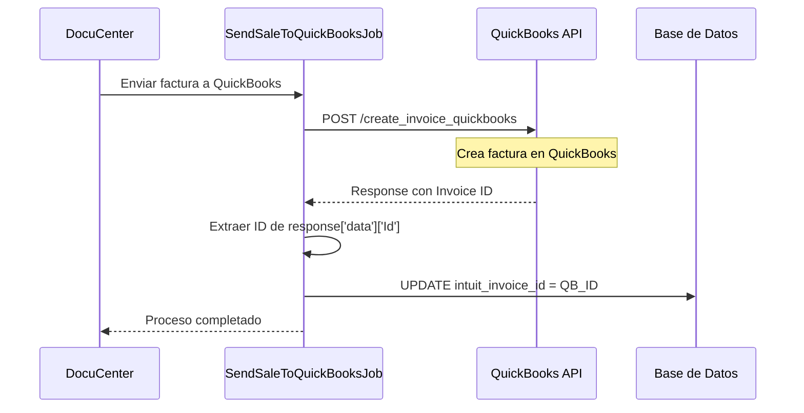

# Cómo se Obtiene el `intuit_invoice_id` en DocuCenter

## Resumen

El campo `intuit_invoice_id` almacena el **ID único de la factura en QuickBooks** que se obtiene cuando DocuCenter registra exitosamente una factura en el sistema de Intuit QuickBooks a través de su API.

## Flujo de Obtención del `intuit_invoice_id`

### 1. **Origen del Valor**
El `intuit_invoice_id` se obtiene de la respuesta de la **API de QuickBooks** cuando se crea una factura exitosamente.

### 2. **Jobs Principales que Asignan el Valor**

#### A. `SendSaleToQuickBooksJob.php` (Creación inicial)
```php
// app/Jobs/SendSaleToQuickBooksJob.php línea ~199
$invoiceData = array_get($qbResponse, 'data', []);
$qbInvoiceId = array_get($invoiceData, 'Id');  // ← Aquí se extrae

// Se guarda en la base de datos
$this->sale->update([
    'intuit_sync_status' => 'completed',
    'intuit_invoice_id' => $qbInvoiceId,  // ← Aquí se asigna
    'intuit_extracted_cufe' => $cufe,
    'intuit_sync_step' => 6,
    'intuit_sync_errors' => null,
    'intuit_last_attempt' => now(),
]);
```

#### B. `UpdateIntuitOrdersJob.php` (Sincronización de órdenes)
```php
// app/Jobs/Intuit/UpdateIntuitOrdersJob.php línea ~738
$invoiceData = array_get($resultUpdateInvoice, 'data', []);
$invoiceId = array_get($invoiceData, 'Id');  // ← Extrae ID de QB

$salesHeader->update([
    'intuit_invoice_id' => $invoiceId,  // ← Asigna el ID
    'intuit_sync_step' => 4
]);
```

### 3. **Proceso Técnico Completo**



### 4. **Estructura de la Respuesta de QuickBooks**

Cuando se registra exitosamente una factura, QuickBooks devuelve:

```json
{
    "success": true,
    "data": {
        "Id": "1247",           // ← Este es el intuit_invoice_id
        "SyncToken": "1",
        "MetaData": {
            "CreateTime": "2025-09-15T19:13:44-07:00",
            "LastUpdatedTime": "2025-09-15T19:13:46-07:00"
        },
        "DocNumber": "FC0000002369",
        "TxnDate": "2025-09-15",
        // ... más campos
    }
}
```

### 5. **Trait Responsable de la Comunicación**

La comunicación con QuickBooks se maneja a través de:

**`UpdateIntuitOrdersTrait.php`**:
```php
protected function registerInvoiceQB(string $email, string $password, array $datos)
{
    return $this->registerInQuickBooks($email, $password, $datos, '/aciv2/create_invoice_quickbooks');
}

protected function registerInQuickBooks(string $email, string $password, array $datos, string $endpoint)
{
    $client = new \GuzzleHttp\Client([
        'base_uri' => 'https://us-central1-zoho-books-edocs-integracion.cloudfunctions.net',
    ]);
    
    $response = $client->request('GET', $endpoint, [
        'auth' => [$email, $password],
        'headers' => ['Content-Type' => 'application/json'],
        'query' => $datos,
    ]);
    
    return json_decode($response->getBody()->getContents(), true);
}
```

### 6. **Validaciones y Estados**

#### Estados del Campo `intuit_invoice_id`:
- **`NULL`**: Factura nunca enviada a QuickBooks
- **`Valor numérico`**: ID válido de factura en QuickBooks (ej: "1247", "1249")

#### En el Command `UpdateQuickBooksInvoicesCommand.php`:
```php
// Filtra solo facturas que YA existen en QuickBooks
->whereNotNull('intuit_invoice_id');

// Cuenta facturas sin ID de QuickBooks
['SIN intuit_invoice_id', $invoices->whereNull('intuit_invoice_id')->count()]
```

### 7. **Problemas Comunes**

#### **Facturas sin `intuit_invoice_id`**
**Causa**: 
- Job `SendSaleToQuickBooksJob` falló antes de completarse
- Error en la comunicación con API de QuickBooks
- Timeout en el proceso de creación

**Solución**:
```bash
# Re-enviar facturas específicas
php artisan quickbooks:send-sale {organization_id} --invoice_ids=123,456,789

# Verificar logs de errores
grep "SendSaleToQuickBooks" storage/logs/laravel.log
```

#### **IDs Desactualizados**
**Causa**: Factura fue eliminada/modificada manualmente en QuickBooks

**Solución**:
- Usar `UpdateQuickBooksInvoicesJob` para sincronizar
- Verificar estado en QuickBooks antes de operaciones

### 8. **Modelo de Base de Datos**

#### Tabla: `sales_header_imp`
```sql
-- Campo en el schema
`intuit_invoice_id` varchar(255) NULL,

-- Índices recomendados
INDEX idx_intuit_invoice_id (intuit_invoice_id),
INDEX idx_intuit_sync_status (intuit_sync_status),
```

#### En el Modelo `SalesHeaderImp.php`:
```php
/**
 * @property string $intuit_invoice_id
 */
protected $fillable = [
    // ... otros campos
    'intuit_invoice_id',
    'intuit_sync_status',
    'intuit_sync_step',
    // ...
];
```

### 9. **Comandos Útiles para Debugging**

```bash
# Ver facturas sin intuit_invoice_id
php artisan quickbooks:update-invoices {org_id} --dry-run

# Buscar por ID específico en logs
grep "intuit_invoice_id.*1247" storage/logs/laravel.log

# Verificar estado de sincronización
php artisan tinker
>>> App\Models\SalesHeaderImp::whereNotNull('intuit_invoice_id')->count()
```

### 10. **Mejores Prácticas**

1. **Siempre verificar** que `intuit_invoice_id` no sea NULL antes de operaciones de actualización
2. **Logear el ID** cuando se asigna para auditoría
3. **Manejar timeouts** en la comunicación con QuickBooks
4. **Implementar retry logic** para casos de fallo temporal

---

## Conclusión

El `intuit_invoice_id` es un **identificador crítico** que vincula las facturas de DocuCenter con QuickBooks. Se obtiene **únicamente** cuando se registra exitosamente una factura en QuickBooks a través de la API, y es **esencial** para todas las operaciones posteriores de sincronización y actualización.

**Ubicación del campo**: `sales_header_imp.intuit_invoice_id`  
**Tipo**: `varchar(255)` nullable  
**Origen**: Response de QuickBooks API `data.Id`  
**Jobs responsables**: `SendSaleToQuickBooksJob`, `UpdateIntuitOrdersJob`
