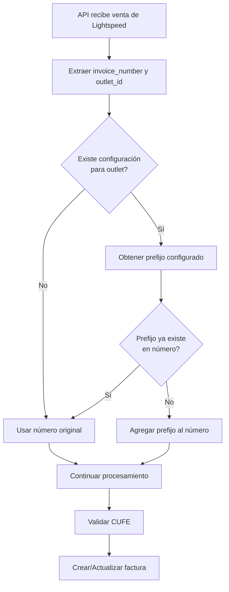

# Prefijos de Factura por Tienda - Lightspeed X-Series

## Resumen

Sistema de prefijos configurables por tienda (outlet) en Lightspeed X-Series para evitar colisiones de números de factura entre múltiples tiendas de una misma organización.

## Problema Resuelto

Cuando una organización tiene múltiples tiendas en Lightspeed X-Series, pueden existir números de factura idénticos entre diferentes tiendas, lo que causa colisiones en el sistema de facturación electrónica de DocuCenter.

**Ejemplo del problema:**
- Tienda A genera factura #1001
- Tienda B genera factura #1001
- Sin prefijos: Ambas se procesan como factura "1001" → Colisión

**Con prefijos:**
- Tienda A (prefijo: "T1-") → Factura "T1-1001"
- Tienda B (prefijo: "T2-") → Factura "T2-1001"
- Sin colisión, facturas únicas en el sistema

## Implementación

### 1. Cambios en la Base de Datos

La configuración de prefijos se almacena en la tabla `lightspeed_configurations` dentro del campo `configurations` (JSON):

```json
{
  "outlets": [
    {
      "id_outlet": "12345",
      "codigo_secursal": "001",
      "invoice_prefix": "T1-"
    },
    {
      "id_outlet": "67890",
      "codigo_secursal": "002",
      "invoice_prefix": "T2-"
    }
  ]
}
```

### 2. Interfaz de Usuario

**Ubicación:** `admin/e_invoice/configuration/lightspeed_settings`

**Archivo:** `resources/views/livewire/admin/einvoice/lightspeed_setting.blade.php`

La tabla de configuración ahora incluye:
- **Store:** Tienda de Lightspeed
- **Branch:** Código de sucursal para facturación
- **Invoice Prefix:** Prefijo único para facturas de esta tienda

**Características:**
- Campo de texto con máximo 10 caracteres
- Placeholder sugerido: "Ej: T1-"
- Texto de ayuda explicativo

### 3. Componente Livewire

**Archivo:** `app/Http/Livewire/Admin/Einvoice/AssignBranch.php`

**Reglas de validación actualizadas:**
```php
protected $rules = [
    'organization_id' => 'required',
    'configurations.outlets.*.id_outlet' => 'nullable',
    'configurations.outlets.*.codigo_secursal' => 'nullable',
    'configurations.outlets.*.invoice_prefix' => 'nullable|string|max:10',
    'configurations.ignore_products' => 'nullable',
];
```

**Método loadOutlets actualizado:**
```php
foreach ($outlets as $key => $outlet) {
    $this->configurations['outlets'][$key] = [
        'id_outlet' => $outlet['id'] ?? $outlet['id_outlet'],
        'codigo_secursal' => $outlet['codigo_secursal'] ?? '',
        'invoice_prefix' => $outlet['invoice_prefix'] ?? '',
    ];
}
```

### 4. Servicio Lightspeed

**Archivo:** `app/Services/LightspeedService.php`

#### Método Principal: `storeOrder()`

**Aplicación del prefijo:**
```php
// Obtener prefijo de tienda desde la configuración de Lightspeed
$outletId = array_get($request, 'outlet_id', null);
$invoicePrefix = $this->getInvoicePrefixForOutlet($organization, $outletId);

// Aplicar prefijo al número de factura si existe
if (!empty($invoicePrefix) && strpos($number, $invoicePrefix) !== 0) {
    $number = $invoicePrefix . $number;
}
```

**Características:**
- Solo aplica el prefijo si está configurado
- Evita duplicar el prefijo si ya existe
- Se ejecuta antes de la validación de CUFE

#### Método Helper: `getInvoicePrefixForOutlet()`

```php
protected function getInvoicePrefixForOutlet(Organization $organization, $outletId): string
{
    if (empty($outletId)) {
        return '';
    }

    try {
        // Obtener configuración de Lightspeed
        $config = Lightspeedconfiguration::where('organization_id', $organization->id)->first();
        
        if (!$config) {
            return '';
        }

        // Buscar prefijo del outlet específico
        $configurations = $config->getConfigurationsAttribute();
        $outlets = array_get($configurations, 'outlets', []);

        foreach ($outlets as $outlet) {
            if (array_get($outlet, 'id_outlet') == $outletId) {
                return array_get($outlet, 'invoice_prefix', '');
            }
        }

    } catch (\Exception $e) {
        Log::warning("Error al obtener prefijo de factura", [
            'organization_id' => $organization->id,
            'outlet_id' => $outletId,
            'error' => $e->getMessage()
        ]);
    }

    return '';
}
```

**Características:**
- Manejo seguro de errores
- Logging para debugging
- Retorna string vacío si no encuentra configuración
- Busca por ID de outlet

## Flujo de Procesamiento



## Ejemplos de Uso

### Caso 1: Sin Prefijo Configurado
```php
// Request
$request = [
    'invoice_number' => '1001',
    'outlet_id' => '12345'
];

// Resultado: '1001' (sin cambios)
```

### Caso 2: Con Prefijo Configurado
```php
// Configuración
[
    'id_outlet' => '12345',
    'invoice_prefix' => 'T1-'
]

// Request
$request = [
    'invoice_number' => '1001',
    'outlet_id' => '12345'
];

// Resultado: 'T1-1001'
```

### Caso 3: Prefijo Ya Existe
```php
// Configuración
[
    'id_outlet' => '12345',
    'invoice_prefix' => 'T1-'
]

// Request
$request = [
    'invoice_number' => 'T1-1001',
    'outlet_id' => '12345'
];

// Resultado: 'T1-1001' (sin duplicar)
```

## Cambios en Menú

**Archivo:** `resources/views/partials/menu/facturacion.blade.php`

El nombre del menú fue actualizado de "Lightspeed" a "Lightspeed X-Series" para mayor claridad:

```blade
<span class="hide-menu">{{ __('Lightspeed X-Series') }}</span>
```

## Traducciones

**Archivos:**
- `lang/es_panel.json`
- `lang/en_panel.json`

**Nuevas claves agregadas:**
```json
{
    "Invoice Prefix": "Prefijo de Factura",
    "Prefix to avoid duplicate invoice numbers": "Prefijo para evitar números de factura duplicados"
}
```

## Mejores Prácticas

### Definición de Prefijos

1. **Usar identificadores cortos y descriptivos:**
   - Bueno: "T1-", "T2-", "SUC1-"
   - Malo: "TIENDA_PRINCIPAL_", "123456-"

2. **Mantener consistencia:**
   - Usar el mismo formato para todas las tiendas
   - Ejemplo: T1-, T2-, T3- (no mezclar con SUC1-, OUTLET2-)

3. **Considerar longitud:**
   - Máximo 10 caracteres permitido
   - Recomendado: 2-5 caracteres
   - Incluir separador (guión) para legibilidad

### Configuración Inicial

1. Acceder a `admin/e_invoice/configuration/lightspeed_settings`
2. Seleccionar la organización
3. Para cada tienda:
   - Asignar código de sucursal
   - Definir prefijo único
4. Guardar configuración

### Migración de Datos Existentes

Si ya existen facturas sin prefijos:
1. Identificar facturas duplicadas
2. Aplicar prefijos manualmente a través de SQL
3. Configurar prefijos para nuevas facturas

```sql
-- Ejemplo de actualización manual
UPDATE sales_header_imp 
SET InvoiceNumber = CONCAT('T1-', InvoiceNumber)
WHERE IdStore = '12345' 
AND InvoiceNumber NOT LIKE 'T1-%';
```

## Troubleshooting

### Problema: Facturas aún se duplican

**Posibles causas:**
1. Prefijo no configurado para outlet
2. Configuración no guardada correctamente
3. Cache no actualizado

**Solución:**
```bash
# Verificar configuración en BD
docker exec -it docucenter-app-1 php artisan tinker
>>> $config = App\Models\Lightspeedconfiguration::where('organization_id', 1)->first();
>>> $config->getConfigurationsAttribute();

# Limpiar cache si es necesario
docker exec -it docucenter-app-1 php artisan cache:clear
```

### Problema: Prefijo se duplica

**Causa:** El número ya incluye el prefijo

**Solución:** El código ya maneja este caso con:
```php
if (!empty($invoicePrefix) && strpos($number, $invoicePrefix) !== 0) {
    $number = $invoicePrefix . $number;
}
```

### Logging

Para debugging, revisar logs:
```bash
docker exec -it docucenter-app-1 tail -f storage/logs/laravel.log | grep "prefijo"
```

El sistema registra:
- Errores al obtener prefijo
- Organization ID y Outlet ID involucrados
- Mensajes de error específicos

## Casos de Uso Reales

### Organización Multi-Tienda

**Escenario:**
- Organización: "Retail SA"
- 3 tiendas: Principal, Norte, Sur
- Cada tienda genera ~100 facturas/día

**Configuración:**
```json
{
  "outlets": [
    {
      "id_outlet": "001",
      "codigo_secursal": "001",
      "invoice_prefix": "PRI-"
    },
    {
      "id_outlet": "002",
      "codigo_secursal": "002",
      "invoice_prefix": "NOR-"
    },
    {
      "id_outlet": "003",
      "codigo_secursal": "003",
      "invoice_prefix": "SUR-"
    }
  ]
}
```

**Resultado:**
- Principal: PRI-0001, PRI-0002, ...
- Norte: NOR-0001, NOR-0002, ...
- Sur: SUR-0001, SUR-0002, ...

Sin colisiones entre tiendas.

##  Seguridad

- Validación de longitud máxima (10 caracteres)
- Sanitización de entrada
- Manejo seguro de excepciones
- Logging de errores sin exponer datos sensibles

## Métricas de Éxito

- Cero colisiones de números de factura
- Identificación clara de origen de factura
- Configuración flexible por tienda
- Compatibilidad con facturas existentes

## Actualizaciones Futuras

Posibles mejoras:
1. Validación de unicidad de prefijos en UI
2. Sugerencias automáticas de prefijos
3. Reportes por tienda usando prefijos
4. Bulk update de prefijos
5. Validación de formato de prefijo

## Referencias

- [Documentación Lightspeed X-Series API](../api/fe/lightspeed-api.md)
- [Modelo Lightspeedconfiguration](../../app/Models/Lightspeedconfiguration.php)
- [LightspeedService](../../app/Services/LightspeedService.php)
- [Vista de configuración](../../resources/views/livewire/admin/einvoice/lightspeed_setting.blade.php)

---

**Fecha de implementación:** Enero 2026  
**Autor:** Sistema DocuCenter  
**Versión:** 1.0
