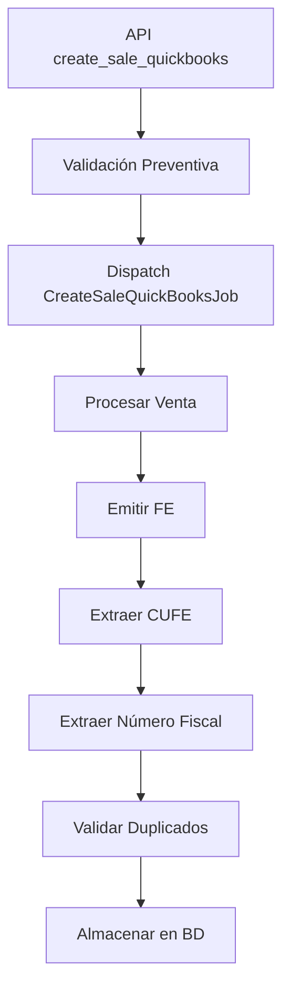

# Sistema de Validación de Números Fiscales QuickBooks

**Fecha:** 13 de septiembre de 2025  
**Versión:** 1.0  
**Autor:** Sistema DocuCenter  

## Resumen

Implementación de un sistema completo de validación de números fiscales para prevenir la duplicación de documentos fiscales en la integración QuickBooks, solucionando el problema de múltiples facturas del mismo cliente con diferentes números fiscales.

## Problema Identificado

### Situación Original
- **Cliente:** VentasGT
- **Problema:** Facturas duplicadas en QuickBooks con diferentes números fiscales
  - Factura 1: CUFE con fiscal `3162`
  - Factura 2: CUFE con fiscal `3134`
- **Impacto:** Duplicación de documentos fiscales para el mismo cliente
- **Causa:** Falta de validación por número fiscal extraído del CUFE

### Análisis del CUFE Panameño
```
CUFE: FE0120240826602793000000390500200000009773162
Estructura:
- Posiciones 1-2: FE (Factura Electrónica)
- Posiciones 3-10: Fecha emisión
- Posiciones 11-24: RUC del emisor
- Posiciones 25-40: Datos del documento
- Posiciones 41-44: NÚMERO FISCAL (3162)
- Posiciones 45+: Datos adicionales
```

## Arquitectura de la Solución

### Componentes Implementados

1. **CufeValidationHelper** - Lógica central de extracción y validación
2. **SalesHeaderImp Model** - Almacenamiento del número fiscal
3. **CreateSaleQuickBooksJob** - Procesamiento y extracción automática
4. **FeController** - Validación preventiva en API
5. **AddFiscalDocumentNumberColumnCommand** - Migración para bases de datos cliente
6. **Tests** - Validación unitaria e integración

### Flujo de Validación



## Implementación Detallada

### 1. Helper de Validación CUFE

**Ubicación:** `app/Helpers/CufeValidationHelper.php`

#### Método: `extractFiscalNumberFromCufe($cufe)`
```php
/**
 * Extrae el número fiscal del CUFE panameño
 * @param string|null $cufe CUFE completo
 * @return string|null Número fiscal (4 dígitos) o null si inválido
 */
public static function extractFiscalNumberFromCufe($cufe): ?string
{
    if (empty($cufe) || !is_string($cufe)) return null;
    if (strlen($cufe) < 45) return null;
    if (!str_starts_with($cufe, 'FE')) return null;
    
    return substr($cufe, 40, 4); // Posiciones 41-44
}
```

#### Método: `checkExistingFiscalNumber($fiscalNumber, $organizationId, $excludeSaleId)`
```php
/**
 * Verifica si existe una factura con el mismo número fiscal
 * @param string $fiscalNumber Número fiscal a validar
 * @param int $organizationId ID de la organización
 * @param int|null $excludeSaleId ID de venta a excluir
 * @return array Resultado de la validación
 */
```

### 2. Modelo SalesHeaderImp

**Archivo:** `app/Models/SalesHeaderImp.php`

#### Cambios Implementados
```php
// Documentación de propiedades
/**
 * @property string $fiscal_document_number
 */

// Fillable
protected $fillable = [
    // ... campos existentes
    'intuit_extracted_cufe',
    'fiscal_document_number', // ← NUEVO
    'intuit_sync_attempts',
    // ...
];
```

### 3. Job CreateSaleQuickBooksJob

**Archivo:** `app/Jobs/CreateSaleQuickBooksJob.php`

#### Método: `extractAndStoreFiscalNumber($sale)`
```php
protected function extractAndStoreFiscalNumber(\App\Models\SalesHeaderImp $sale): void
{
    try {
        DB::connection()->useDatabase($this->organization->database);
        $sale->refresh();
        
        $cufe = $sale->getAttribute('intuit_extracted_cufe');
        if (empty($cufe)) return;
        
        $fiscalNumber = CufeValidationHelper::extractFiscalNumberFromCufe($cufe);
        if (empty($fiscalNumber)) return;
        
        // Validar duplicados
        $existingValidation = CufeValidationHelper::checkExistingFiscalNumber(
            $fiscalNumber, 
            $this->organization->id,
            $sale->getKey()
        );
        
        if ($existingValidation['exists']) {
            Log::warning("Número fiscal duplicado detectado", [...]);
        }
        
        // Almacenar número fiscal
        $sale->update(['fiscal_document_number' => $fiscalNumber]);
        
    } catch (\Exception $e) {
        Log::error("Error al extraer número fiscal", [...]);
    } finally {
        DB::connection()->useDatabase(env('DB_DATABASE'));
    }
}
```

### 4. FeController Validación Preventiva

**Archivo:** `app/Http/Controllers/V1/FeController.php`

#### Método: `validateQuickBooksInvoiceDuplication($organization, $requestData)`
```php
protected function validateQuickBooksInvoiceDuplication(\App\Models\Organization $organization, array $requestData): void
{
    // Extraer datos básicos
    $invoiceData = $requestData['Invoice'] ?? $requestData;
    $customerName = $invoiceData['CustomerRef']['name'] ?? 'QuickBooks Customer';
    $totalAmount = (float) ($invoiceData['TotalAmt'] ?? 0);
    
    // Buscar facturas similares en los últimos 30 días
    $suspiciousSales = \App\Models\SalesHeaderImp::where('CustomerName', 'LIKE', '%' . trim($customerName) . '%')
        ->where('Net_due', '>=', $totalAmount * 0.95) // Tolerancia 5%
        ->where('Net_due', '<=', $totalAmount * 1.05)
        ->whereNotNull('fiscal_document_number')
        ->where('origin', 'quickbooks')
        ->where('created_at', '>', now()->subDays(30))
        ->get();
        
    if ($suspiciousSales->isNotEmpty()) {
        Log::warning("Detectadas facturas QuickBooks potencialmente duplicadas", [...]);
    }
}
```

### 5. Comando de Migración

**Archivo:** `app/Console/Commands/Configuration/AddFiscalDocumentNumberColumnCommand.php`

#### Uso
```bash
# Agregar columna a todas las organizaciones
php artisan db:add-fiscal-document-number-column

# Agregar solo a organización específica
php artisan db:add-fiscal-document-number-column --org-id=123

# Modo dry-run (solo mostrar cambios)
php artisan db:add-fiscal-document-number-column --dry-run
```

### 6. Stub de Base de Datos

**Archivo:** `app/Models/stubs/Sales_Header_Imp.sql.stub`

```sql
`intuit_extracted_cufe` varchar(255) NULL,
`fiscal_document_number` varchar(20) NULL,  -- ← NUEVO
`intuit_sync_attempts` int DEFAULT 0,
```

## Testing

### Tests Unitarios

**Archivo:** `tests/Unit/Helpers/CufeValidationHelperTest.php`

#### Casos de Prueba
```php
// Extracción correcta
test_extract_fiscal_number_from_cufe_extracts_correct_number()
// CUFE: FE0120240826602793000000390500200000009773162 → 3162

// Diferentes números
test_extract_fiscal_number_from_cufe_extracts_different_number()
// CUFE: FE0120240826602793000000390500200000009773134 → 3134

// CUFEs inválidos
test_extract_fiscal_number_from_short_cufe_returns_null()
test_extract_fiscal_number_from_empty_cufe_returns_null()
test_extract_fiscal_number_from_invalid_format_returns_null()
```

### Tests de Integración

**Archivo:** `tests/Unit/Jobs/CreateSaleQuickBooksJobFiscalValidationTest.php`

#### Validaciones
- Extracción de números fiscales desde CUFE
- Manejo de CUFEs inválidos
- Estructura del job CreateSaleQuickBooksJob
- Integración completa del sistema

## Casos de Uso

### Ejemplo 1: Cliente con Factura Duplicada
```php
// Factura Original
$cufe1 = 'FE0120240826602793000000390500200000009773162'; // Fiscal: 3162
$sale1 = SalesHeaderImp::create([
    'intuit_extracted_cufe' => $cufe1,
    'fiscal_document_number' => '3162',
    'CustomerName' => 'VentasGT',
    // ...
]);

// Intento de Factura Duplicada
$cufe2 = 'FE0120240826602793000000390500200000009773134'; // Fiscal: 3134
$validation = CufeValidationHelper::checkExistingFiscalNumber('3134', $orgId);

// Resultado: Se detecta patrón sospechoso por mismo cliente
```

### Ejemplo 2: Validación en API
```bash
POST /api/v1/fe/create_sale_quickbooks
{
    "Invoice": {
        "DocNumber": "INV-001",
        "CustomerRef": {"name": "VentasGT"},
        "TotalAmt": 115.00
    }
}

# Flujo:
# 1. validateQuickBooksInvoiceDuplication() busca facturas similares
# 2. Si encuentra patrones sospechosos → Log warning
# 3. Continúa con procesamiento normal
# 4. extractAndStoreFiscalNumber() valida al extraer CUFE
```

## Configuración y Despliegue

### 1. Agregar Columna a Bases de Datos Existentes
```bash
# Ejecutar comando para todas las organizaciones
php artisan db:add-fiscal-document-number-column

# Verificar cambios antes de aplicar
php artisan db:add-fiscal-document-number-column --dry-run
```

### 2. Verificar Funcionamiento
```bash
# Ejecutar tests
php artisan test tests/Unit/Helpers/CufeValidationHelperTest.php
php artisan test tests/Unit/Jobs/CreateSaleQuickBooksJobFiscalValidationTest.php

# Monitorear logs
tail -f storage/logs/laravel.log | grep "fiscal"
```

## Monitoreo y Logging

### Eventos Loggeados

1. **Extracción exitosa de número fiscal**
```
"Job CreateSaleQuickBooks: Número fiscal extraído y almacenado exitosamente"
```

2. **Detección de duplicados**
```
"Job CreateSaleQuickBooks: Número fiscal duplicado detectado"
```

3. **Validación preventiva**
```
"FeController: Detectadas facturas QuickBooks potencialmente duplicadas"
```

4. **Errores de extracción**
```
"Job CreateSaleQuickBooks: Error al extraer número fiscal"
```

### Consultas de Monitoreo

```sql
-- Verificar números fiscales duplicados
SELECT fiscal_document_number, COUNT(*) as count
FROM Sales_Header_Imp 
WHERE fiscal_document_number IS NOT NULL 
  AND origin = 'quickbooks'
GROUP BY fiscal_document_number 
HAVING COUNT(*) > 1;

-- Facturas sin número fiscal
SELECT COUNT(*) as sin_fiscal
FROM Sales_Header_Imp 
WHERE intuit_extracted_cufe IS NOT NULL 
  AND fiscal_document_number IS NULL;
```

## Consideraciones de Rendimiento

### Optimizaciones Implementadas
1. **Validación asíncrona:** Extracción en background job
2. **Validación preventiva:** Solo facturas sospechosas en últimos 30 días
3. **Tolerancia de montos:** 5% para evitar falsos positivos
4. **Logs selectivos:** Solo casos relevantes para evitar spam

### Recomendaciones
- Monitorear frecuencia de duplicados detectados
- Ajustar ventana de tiempo (30 días) según necesidades
- Considerar índices en `fiscal_document_number` si el volumen aumenta

## Mantenimiento

### Limpieza de Datos
```sql
-- Actualizar números fiscales faltantes (ejecutar una vez)
UPDATE Sales_Header_Imp 
SET fiscal_document_number = SUBSTRING(intuit_extracted_cufe, 41, 4)
WHERE intuit_extracted_cufe IS NOT NULL 
  AND fiscal_document_number IS NULL 
  AND LENGTH(intuit_extracted_cufe) >= 45
  AND LEFT(intuit_extracted_cufe, 2) = 'FE';
```

### Verificación Periódica
```bash
# Script de verificación mensual
php artisan tinker
>>> $duplicates = \DB::select("SELECT fiscal_document_number, COUNT(*) as count FROM Sales_Header_Imp WHERE fiscal_document_number IS NOT NULL GROUP BY fiscal_document_number HAVING COUNT(*) > 1");
>>> dd($duplicates);
```

## Resolución de Problemas

### Problema: CUFE sin número fiscal
**Síntoma:** `intuit_extracted_cufe` poblado pero `fiscal_document_number` es NULL  
**Solución:** Verificar longitud de CUFE y formato

### Problema: Falsos positivos en validación
**Síntoma:** Alertas de duplicación para facturas legítimas  
**Solución:** Ajustar tolerancia de montos o ventana de tiempo

### Problema: Performance lenta en validación
**Síntoma:** API lenta en `create_sale_quickbooks`  
**Solución:** Agregar índices o reducir ventana de búsqueda

## Roadmap Futuro

### Mejoras Propuestas
1. **Dashboard de monitoreo:** Panel para visualizar duplicados detectados
2. **Notificaciones automáticas:** Alertas por email/Slack en duplicados
3. **Validación más estricta:** Bloquear duplicados en lugar de solo logging
4. **API de consulta:** Endpoint para verificar números fiscales programáticamente

### Extensiones Posibles
- Validación para otros PACs (no solo CUFE panameño)
- Integración con otros sistemas POS
- Histórico de cambios en números fiscales
- Validación cruzada con registros fiscales oficiales

---

**Documentación generada automáticamente el 13 de septiembre de 2025**  
**Sistema DocuCenter - Versión 1.0**
