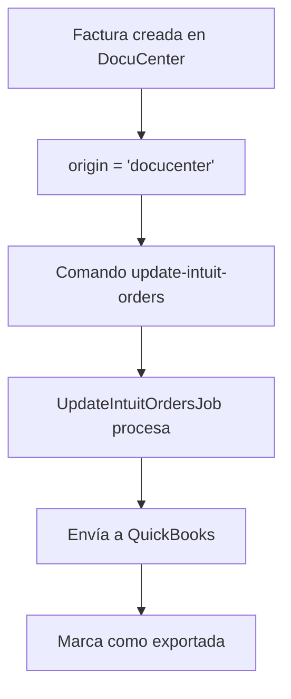
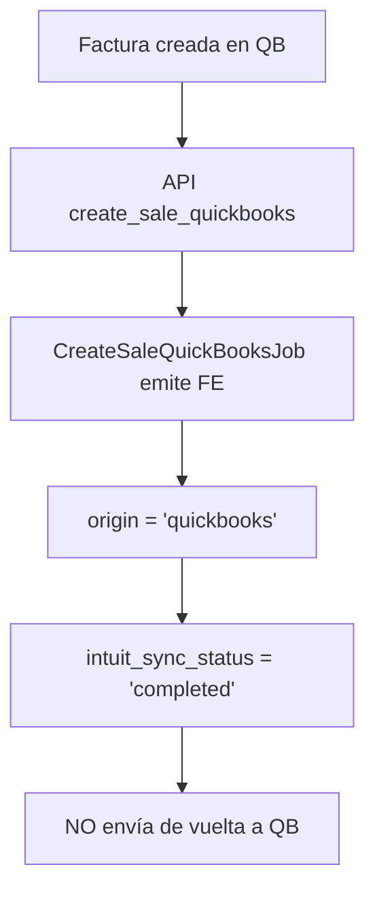

# Solución Loop QuickBooks - Facturas Bidireccionales

## Problema Identificado

**Loop infinito** entre el comando `word:update-intuit-orders` y la API `create_sale_quickbooks`:

1. **API `create_sale_quickbooks`**: Recibe factura de QB → Emite FE → Envía de vuelta a QB
2. **Comando `update-intuit-orders`**: Encuentra la misma factura → La procesa nuevamente
3. **Resultado**: Loop infinito y facturas duplicadas

## Solución Implementada

###  **Campo `origin` en SalesHeaderImp**

**Propósito**: Identificar el origen de cada factura para aplicar lógica diferencial.

```sql
-- Agregado al stub Sales_Header_Imp.sql.stub
`origin` varchar(20) NULL DEFAULT 'docucenter',
KEY `sales_header_imp_origin_index` (`origin`)
```

**Valores posibles**:
- `'docucenter'`: Factura creada en DocuCenter (default)
- `'quickbooks'`: Factura recibida desde QuickBooks
- `'shopify'`: Factura recibida desde Shopify
- `'lightspeed'`: Factura recibida desde Lightspeed
- etc.

###  **Modificación CreateSaleQuickBooksJob**

**Antes**:
```php
// Después de emitir FE, enviaba de vuelta a QB
if ($this->hasActiveQuickBooksConnection()) {
    SendSaleToQuickBooksJob::dispatch($sale->getKey(), $this->organization->id);
}
```

**Después**:
```php
// Marcar como originada en QB y completamente sincronizada
$sale->update([
    'origin' => 'quickbooks',
    'intuit_sync_status' => 'completed',
    'intuit_sync_step' => 6,
    'EzeeExport' => true, // Evitar reprocesamiento
    'intuit_last_attempt' => now(),
]);

// NO enviar de vuelta a QuickBooks (evita loop)
```

###  **Modificación UpdateIntuitOrdersJob**

**Filtro agregado**:
```php
// Solo procesar facturas originadas en DocuCenter
$query->where(function ($subQuery) {
    $subQuery->where('origin', 'docucenter')
            ->orWhereNull('origin'); // Compatibilidad con facturas existentes
});
```

**Logging mejorado**:
```php
Log::info("UpdateIntuitOrdersJob: Iniciando procesamiento de facturas DocuCenter", [
    'organization_id' => $organization->id,
    'total_facturas' => $query->count(),
    'filtros' => [
        'origin' => 'docucenter o null'
    ]
]);
```

## Flujo Corregido

###  **DocuCenter → QuickBooks** (Comando)


###  **QuickBooks → DocuCenter** (API)


## Compatibilidad Retroactiva

### **Facturas Existentes sin `origin`**
- **Comportamiento**: Se tratan como `origin = 'docucenter'` (null = DocuCenter)
- **UpdateIntuitOrdersJob**: Procesa facturas con `origin IS NULL`
- **Sin breaking changes** en facturas existentes

### **Migración Gradual**
```sql
-- Si se requiere actualizar facturas existentes:
UPDATE Sales_Header_Imp 
SET origin = 'docucenter' 
WHERE origin IS NULL 
  AND EzeeImport = 0; -- Facturas creadas localmente
```

## Testing

### **Casos de Prueba**

#### **Caso 1: Factura DocuCenter → QB**
```bash
# 1. Crear factura en DocuCenter
# 2. Ejecutar comando: php artisan word:update-intuit-orders
# 3. Verificar: Factura aparece en QuickBooks
# 4. Verificar: origin = 'docucenter', EzeeExport = true
```

#### **Caso 2: Factura QB → DocuCenter**
```bash
# 1. Crear factura en QuickBooks
# 2. Llamar API: POST /api/v1/fe/create_sale_quickbooks
# 3. Verificar: Factura emitida con FE
# 4. Verificar: origin = 'quickbooks', intuit_sync_status = 'completed'
# 5. Verificar: NO aparece duplicada en QB
```

#### **Caso 3: Loop Evitado**
```bash
# 1. Factura QB → DocuCenter (API)
# 2. Ejecutar comando: php artisan word:update-intuit-orders
# 3. Verificar: Factura QB NO es reprocesada
# 4. Log debe mostrar: "origin = quickbooks, skipped"
```

## Archivos Modificados

### **Estructura de Datos**
- `app/Models/stubs/Sales_Header_Imp.sql.stub` - Campo `origin` agregado
- `app/Models/SalesHeaderImp.php` - Campo agregado a fillable

### **Lógica de Negocio**
- `app/Jobs/CreateSaleQuickBooksJob.php` - No envía de vuelta a QB
- `app/Jobs/Intuit/UpdateIntuitOrdersJob.php` - Filtro por origin

### **Logging y Monitoring**
- Logs detallados para tracking de origen
- Contadores de facturas procesadas por origen

## Beneficios

1. **Elimina loop infinito** entre comando y API
2. **Visibilidad total** del origen de cada factura
3. **Performance mejorado** - menos procesamiento redundante
4. **Compatibilidad** con facturas existentes
5. ** Escalable** para futuras integraciones (Shopify, etc.)

## Monitoreo

### **Queries Útiles**
```sql
-- Ver distribución por origen
SELECT origin, COUNT(*) as total 
FROM Sales_Header_Imp 
GROUP BY origin;

-- Facturas QB que no enviamos de vuelta
SELECT COUNT(*) as facturas_qb_no_loop
FROM Sales_Header_Imp 
WHERE origin = 'quickbooks' 
  AND intuit_sync_status = 'completed';

-- Facturas DocuCenter pendientes de envío
SELECT COUNT(*) as facturas_dc_pendientes
FROM Sales_Header_Imp 
WHERE (origin = 'docucenter' OR origin IS NULL)
  AND EzeeExport = false 
  AND EzeeIssued = true;
```

### **Logs a Monitorear**
- `"UpdateIntuitOrdersJob: Iniciando procesamiento de facturas DocuCenter"`
- `"CreateSaleQuickBooks: Venta marcada como originada en QuickBooks - NO se enviará de vuelta"`
- Conteo de facturas procesadas por origen

Esta solución garantiza flujo bidireccional sin loops, manteniendo trazabilidad completa del origen de cada factura.
