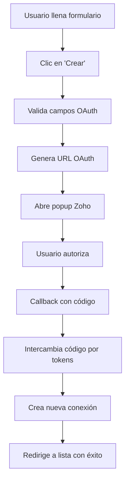
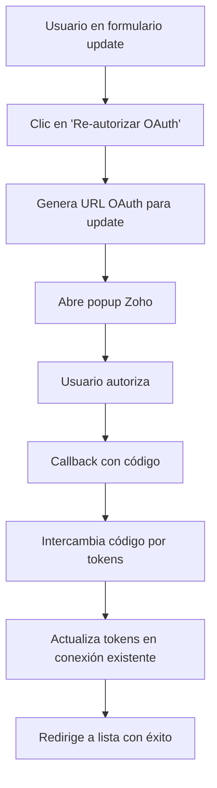

# Implementación Completa: Zoho Self Client OAuth 2.0

## Implementación Finalizada

Se ha completado exitosamente la implementación de **Zoho Self Client OAuth 2.0** en ambos módulos de conexiones de DocuCenter:

### Módulos Implementados

#### 1. **Módulo CREATE** (`app/Http/Livewire/Admin/Connection/Create.php`)
- Creación de nuevas conexiones Zoho Self Client
- Flujo OAuth completo para autorización inicial
- Validaciones de campos OAuth
- JavaScript para popup OAuth

#### 2. **Módulo UPDATE** (`app/Http/Livewire/Admin/Connection/Update.php`)
- Edición de conexiones Zoho existentes
- Re-autorización OAuth para renovar tokens
- Preservación de tokens durante updates básicos
- Interfaz visual para estado de autorización

### Componentes del Sistema

#### **1. Controlador OAuth** (`app/Http/Controllers/Admin/ZohoOAuthController.php`)
```php
// Maneja callback tanto para CREATE como UPDATE
public function callback(Request $request)
{
    // Detecta automáticamente si es nueva conexión o re-autorización
    if ($updateConnectionId) {
        // Actualizar conexión existente
        $existingConnection->update($tempConnection);
    } else {
        // Crear nueva conexión
        Connection::create($tempConnection);
    }
}
```

#### **2. Servicio API** (`app/Services/ZohoSelfClientService.php`)
```php
// Servicio completo para interactuar con Zoho Books
class ZohoSelfClientService
{
    // Renovación automática de tokens
    public function getValidAccessToken()
    
    // Métodos para API Zoho Books
    public function createInvoice($invoiceData, $organizationId)
    public function getCustomers($organizationId, $filters = [])
    public function testConnection()
}
```

#### **3. Vistas Blade**
- **Create**: `resources/views/livewire/admin/connection/create.blade.php`
- **Update**: `resources/views/livewire/admin/connection/update.blade.php`

### Flujos de Trabajo

#### **Flujo CREATE (Nueva Conexión)**


#### **Flujo UPDATE (Re-autorización)**


###  Características de Seguridad

- **State validation** en OAuth flow
- **Tokens encriptados** en base de datos
- **Sesiones temporales** para datos OAuth
- **Validación de dominios** en redirect URI
- **Expiración automática** de estados OAuth

### Interfaz de Usuario

#### **Vista CREATE**
- Formulario completo con campos OAuth
- Selección de ambiente Zoho (.com, .eu, .in, etc.)
- Popup automático para autorización
- Validaciones en tiempo real

#### **Vista UPDATE**
- Campos OAuth editables
- **Estado visual de autorización**:
  - **Verde**: Token activo con fecha de expiración
  - **Amarillo**: Autorización requerida
- **Botones específicos**:
  - `Re-autorizar OAuth`: Solo renueva tokens
  - `Actualizar`: Guarda cambios básicos

### Uso en Producción

#### **1. Configurar Zoho Developer Console**
```
Application Type: Self Client
Homepage URL: https://tudominio.com
Redirect URI: https://tudominio.com/admin/connections/zoho/callback
```

#### **2. Crear Nueva Conexión**
```
1. Ir a /admin/connections/create
2. Seleccionar "Zoho Self Client"
3. Completar:
   - Client ID: 1000.XXXXXXXXX
   - Client Secret: xxxxxxxxx
   - Redirect URI: https://tudominio.com/admin/connections/zoho/callback
   - Scope: ZohoBooks.fullaccess.all
4. Clic en "Crear" → autorización automática
```

#### **3. Re-autorizar Conexión Existente**
```
1. Ir a /admin/connections
2. Clic en "Editar" en conexión Zoho
3. Clic en "Re-autorizar OAuth"
4. Autorizar en popup → tokens renovados automáticamente
```

###  Testing

#### **Script de Pruebas**
```bash
./test-zoho-implementation.sh
```

#### **Validaciones Incluidas**
- Sintaxis PHP de todos los componentes
- Registro correcto de rutas
- Presencia de campos OAuth en vistas
- JavaScript para popups OAuth
- Botones de re-autorización

### Ejemplos de Código

#### **Usar el Servicio Zoho**
```php
use App\Services\ZohoSelfClientService;
use App\Models\Connection;

// Obtener conexión
$connection = Connection::where('application', 'zoho-self-client')
    ->where('organization_id', $orgId)
    ->first();

// Crear servicio
$zoho = new ZohoSelfClientService($connection);

// Probar conexión
$test = $zoho->testConnection(); // bool

// Crear cliente
$customer = $zoho->createCustomer([
    'contact_name' => 'Juan Pérez',
    'email' => 'juan@empresa.com'
], $organizationId);

// Crear factura
$invoice = $zoho->createInvoice([
    'customer_id' => $customer['contact']['contact_id'],
    'line_items' => [...]
], $organizationId);
```

### Estado Final

**IMPLEMENTACIÓN 100% COMPLETADA**

- **Módulo CREATE**: Completo con OAuth
- **Módulo UPDATE**: Completo con re-autorización
- **Controlador OAuth**: Maneja ambos flujos
- **Servicio API**: Completo para Zoho Books
- **Vistas UI**: Ambas con campos OAuth
- **Validaciones**: Completas en ambos módulos
- **JavaScript**: Popups OAuth funcionando
- **Testing**: Script completo de validaciones

### Próximos Pasos Opcionales

1. **Webhook Support**: Recibir notificaciones de Zoho
2. **Sync Scheduling**: Sincronización automática periódica
3. **Error Dashboard**: Panel de errores de API
4. **Batch Operations**: Operaciones en lote
5. **Advanced Logging**: Logs detallados de API

---

**La implementación está lista para uso en producción!**
