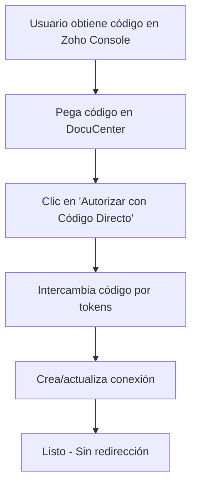
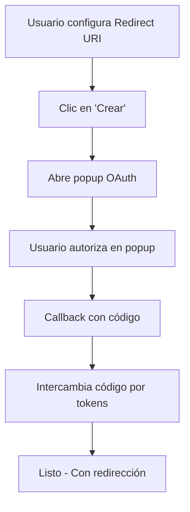

# Zoho Self Client: Autorización Directa con Código

## Funcionalidad Implementada

Se ha agregado soporte para **autorización directa usando código** generado desde Zoho Developer Console, eliminando la necesidad de configurar redirección para Self Client.

### Características del Código Directo

#### **Zoho Self Client - Código de Autorización**
- **Duración**: 3 minutos de validez
- **Formato**: `1000.05a9e3d31399558abbc0ec8f5a6f853a.ac6bfd43b6d71a8a20502b069f405b7c`
- **Scope**: `ZohoBooks.fullaccess.all`
- **Sin redirección**: No requiere configurar Redirect URI

### Generación del Código en Zoho Console

#### **Pasos para obtener el código:**
1. Ir a [Zoho Developer Console](https://api-console.zoho.com/)
2. Seleccionar tu aplicación **Self Client**
3. Ir a la sección **"Self Client"**
4. Clic en **"Generate Code"**
5. Seleccionar scope: **`ZohoBooks.fullaccess.all`**
6. Copiar el código generado (válido por 3 minutos)

### Uso en DocuCenter

#### **Opción 1: Autorización Directa (Recomendado para Self Client)**
```
1. Ir a /admin/connections/create
2. Seleccionar "Zoho Self Client"
3. Completar SOLO:
   - Client ID: 1000.XXXXXXXXX
   - Client Secret: xxxxxxxxx
   - Zoho Environment: com (o tu región)
4. Generar código en Zoho Console
5. Pegar código en "Código de Autorización Directo"
6. Clic en "Autorizar con Código Directo"
   Conexión creada automáticamente
```

#### **Opción 2: OAuth Tradicional (Opcional)**
```
1. Configurar también:
   - Redirect URI: https://tudominio.com/admin/connections/zoho/callback
   - Scope: ZohoBooks.fullaccess.all
2. Clic en "Crear" para iniciar flujo OAuth
```

### Re-autorización en Conexiones Existentes

#### **Re-autorización Directa**
```
1. Ir a /admin/connections
2. Editar conexión Zoho existente
3. Generar nuevo código en Zoho Console
4. Pegar en "Código de Autorización Directo"
5. Clic en "Re-autorizar con Código Directo"
   Tokens renovados automáticamente
```

### Código Implementado

#### **Método de Autorización Directa**
```php
public function authorizeWithDirectCode()
{
    // Validar código y credenciales
    if (empty($this->zoho_direct_code)) {
        $this->dispatchBrowserEvent('show-message', [
            'type' => 'error',
            'message' => 'Por favor ingrese el código de autorización'
        ]);
        return;
    }

    // Intercambiar código por tokens
    $tokenData = $this->exchangeDirectCodeForToken($this->zoho_direct_code);
    
    // Crear/actualizar conexión con tokens
    if ($tokenData) {
        $this->settings['access_token'] = $tokenData['access_token'];
        $this->settings['refresh_token'] = $tokenData['refresh_token'];
        $this->settings['token_expires_at'] = now()->addSeconds($tokenData['expires_in']);
        
        // Crear conexión directamente
        Connection::create([...]);
    }
}
```

#### **Intercambio de Código por Tokens**
```php
private function exchangeDirectCodeForToken($code)
{
    $tokenUrl = "https://accounts.zoho.{$this->zoho_environment}/oauth/v2/token";
    
    $response = $client->post($tokenUrl, [
        'form_params' => [
            'code' => $code,
            'client_id' => $this->settings['client_id'],
            'client_secret' => $this->settings['client_secret'],
            'grant_type' => 'authorization_code'
            // NO REQUIERE redirect_uri para Self Client
        ]
    ]);
    
    return json_decode($response->getBody(), true);
}
```

### Ventajas del Código Directo

| Aspecto | Código Directo | OAuth Tradicional |
|---------|----------------|-------------------|
| **Configuración** | Mínima | Requiere Redirect URI |
| **Tiempo** | Inmediato | Requiere popup |
| **Validez** | 3 minutos | Configuración permanente |
| **Self Client** | Nativo | Funciona |
| **Producción** | Ideal | También funciona |

###  Consideraciones de Seguridad

#### **Código Directo**
- **Válido solo 3 minutos** - Minimiza exposición
- **Una sola vez** - Se invalida después del uso
- **Sin redirección** - Menos superficie de ataque
- **Manual** - Requiere regenerar para re-autorización

#### **OAuth Tradicional**
- **Configuración permanente** - Una vez configurado, siempre funciona
- **Automático** - Sin intervención manual
- **Redirect URI** - Debe ser configurado correctamente

### Interfaz de Usuario

#### **Vista Create**
```html
<!-- Campo de código directo -->
<input wire:model.lazy="zoho_direct_code" 
       placeholder="1000.05a9e3d31399558abbc0ec8f5a6f853a.ac6bfd43b6d71a8a20502b069f405b7c">

<!-- Botón de autorización directa -->
<button wire:click="authorizeWithDirectCode" 
        class="btn btn-success"
        @if(empty($zoho_direct_code)) disabled @endif>
    Autorizar con Código Directo
</button>
```

#### **Vista Update**
```html
<!-- Re-autorización directa -->
<button wire:click="reauthorizeWithDirectCode"
        class="btn btn-success">
    Re-autorizar con Código Directo
</button>
```

### Flujo Comparativo

#### **Flujo con Código Directo**


#### **Flujo OAuth Tradicional**


### Resultado Final

**AMBAS OPCIONES IMPLEMENTADAS:**

#### **Código Directo (Recomendado para Self Client)**
- Configuración mínima
- Sin Redirect URI necesario
- Autorización inmediata
- Ideal para desarrollo y producción

#### **OAuth Tradicional (Funciona también)**
- Configuración completa con Redirect URI
- Popup automático
- Una vez configurado, siempre funciona
- Compatible con otros tipos de aplicación

### Recomendación de Uso

**Para Self Client en producción:**
1. **Usar código directo** para configuración inicial rápida
2. **Configurar OAuth tradicional** como respaldo
3. **Renovar con código directo** cuando sea necesario

¡La implementación ofrece **máxima flexibilidad** para diferentes necesidades! 
