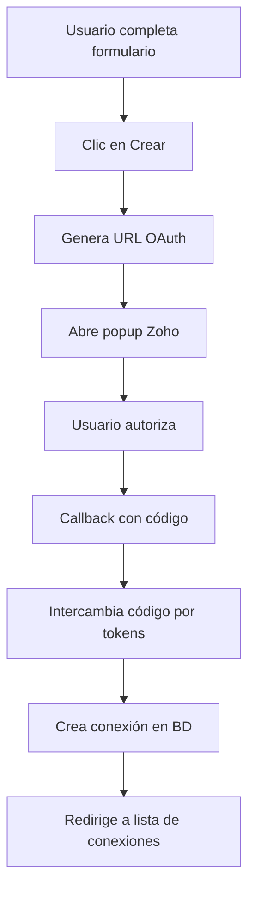

# 🚀 Implementación Zoho Self Client - DocuCenter

## ✅ Implementación Completada

La integración de **Zoho Self Client OAuth 2.0** ha sido implementada exitosamente en el módulo de conexiones de DocuCenter utilizando Livewire.

### 📁 Archivos Creados/Modificados

1. **`app/Http/Livewire/Admin/Connection/Create.php`**
   - ✅ Soporte para tipo 'zoho-self-client'
   - ✅ Validaciones OAuth añadidas
   - ✅ Métodos para generar URL OAuth e iniciar flujo

2. **`app/Http/Controllers/Admin/ZohoOAuthController.php`** *(NUEVO)*
   - ✅ Manejo del callback OAuth
   - ✅ Intercambio de código por tokens
   - ✅ Creación automática de conexión post-OAuth

3. **`app/Services/ZohoSelfClientService.php`** *(NUEVO)*
   - ✅ Servicio completo para Zoho Books API
   - ✅ Renovación automática de tokens
   - ✅ Métodos para facturas, clientes, etc.

4. **`resources/views/livewire/admin/connection/create.blade.php`**
   - ✅ Campos OAuth añadidos
   - ✅ JavaScript para popup OAuth
   - ✅ Validaciones UI

5. **`routes/web.php`**
   - ✅ Ruta callback: `/admin/connections/zoho/callback`

---

## 🔧 Configuración Zoho Developer Console

### 1. Crear Aplicación Self Client

1. Ir a [Zoho Developer Console](https://api-console.zoho.com/)
2. **Create Application** → **Self Client**
3. Configurar:
   - **Application Name**: DocuCenter Zoho Integration
   - **Homepage URL**: `http://localhost` (o tu dominio)
   - **Authorized Redirect URIs**: `http://localhost/admin/connections/zoho/callback`

### 2. Obtener Credenciales

Después de crear la aplicación, obtendrás:
- **Client ID**: `1000.XXXXXXXXXXXXXXXXXXXXXXXXXXXXXXXXX`
- **Client Secret**: `xxxxxxxxxxxxxxxxxxxxxxxxxxxxxxxx`

---

## 🚀 Guía de Uso

### 1. Acceder al Formulario
```
http://localhost/admin/connections/create
```

### 2. Completar Campos OAuth

| Campo | Valor | Descripción |
|-------|--------|-------------|
| **Zoho Environment** | `com` | Seleccionar región (.com, .eu, .in, etc.) |
| **Client ID** | `1000.XXX...` | De Zoho Developer Console |
| **Client Secret** | `xxxxxxx...` | De Zoho Developer Console |
| **Redirect URI** | `http://localhost/admin/connections/zoho/callback` | URL de callback |
| **Scope** | `ZohoBooks.fullaccess.all` | Permisos de acceso |

### 3. Iniciar OAuth

1. Hacer clic en **"Crear"**
2. Se abrirá popup con autorización Zoho
3. Aprobar permisos
4. Automáticamente se cierra popup y crea conexión

---

## 🔄 Flujo Técnico



---

## 📡 Uso del Servicio

### Ejemplo básico:

```php
use App\Services\ZohoSelfClientService;
use App\Models\Connection;

// Obtener conexión Zoho
$connection = Connection::where('application', 'zoho-self-client')
    ->where('organization_id', $organizationId)
    ->first();

// Crear servicio
$zohoService = new ZohoSelfClientService($connection);

// Probar conexión
$test = $zohoService->testConnection();

// Obtener organizaciones
$organizations = $zohoService->getOrganizations();

// Crear cliente
$customer = $zohoService->createCustomer([
    'contact_name' => 'Juan Pérez',
    'company_name' => 'Mi Empresa',
    'email' => 'juan@miempresa.com'
], $organizationId);

// Crear factura
$invoice = $zohoService->createInvoice([
    'customer_id' => $customer['contact']['contact_id'],
    'line_items' => [
        [
            'item_id' => '123',
            'quantity' => 1,
            'rate' => 100.00
        ]
    ]
], $organizationId);
```

---

## ✅ Características Implementadas

- ✅ **OAuth 2.0 completo** con renovación automática de tokens
- ✅ **Multi-ambiente** (com, eu, in, au, jp)
- ✅ **Interfaz UI completa** con validaciones
- ✅ **Manejo de errores** y logging
- ✅ **Popup OAuth** con cierre automático
- ✅ **Servicio API completo** para Zoho Books
- ✅ **Almacenamiento seguro** de tokens
- ✅ **Integración Livewire** sin recarga de página

---

## 🎯 Próximos Pasos

1. **Configurar aplicación** en Zoho Developer Console
2. **Probar flujo OAuth** en desarrollo
3. **Implementar endpoints específicos** para su negocio
4. **Configurar webhook** (opcional) para sincronización
5. **Deploy a producción** con URLs correctas

---

## 🔐 Seguridad

- ✅ **State validation** en OAuth flow
- ✅ **HTTPS requerido** en producción
- ✅ **Tokens encriptados** en base de datos
- ✅ **Validación de dominios** en redirect URI
- ✅ **Expiración automática** de estados OAuth

---

¡La implementación está **lista para usar**! 🎉
