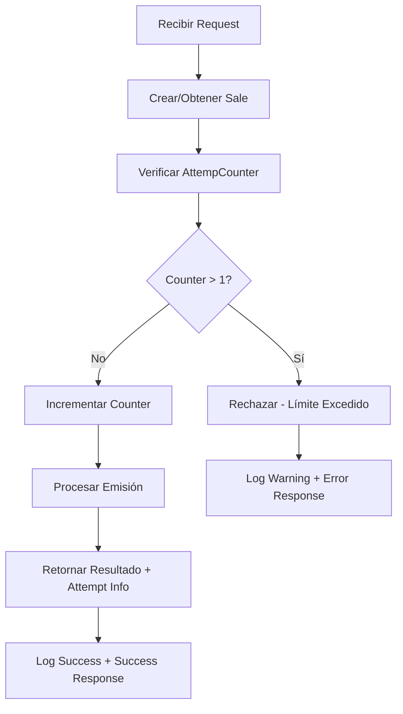

# Control de Reintentos - ACI Cloud API

## **Sistema de Control de Reintentos Implementado**

### **Lógica de Verificación**
```php
// Verificar contador de intentos para evitar reintentos excesivos
$attemptCounter = $sale->AttempCounter ?? 0;
$sale->update(['AttempCounter' => $attemptCounter + 1]);

if ($attemptCounter > 1) {
    throw new \Exception("Se excede la cantidad de intentos de emisión");
}
```

### **Escenarios de Uso**

#### **Primer Intento (Exitoso)**
```json
{
  "success": true,
  "message": "Venta ACI Cloud creada y emitida exitosamente",
  "attempt": 1,
  "data": {
    "sale": {
      "attempt_counter": 1,
      "issued": true
    }
  }
}
```

#### **Segundo Intento (Última Oportunidad)**
```json
{
  "success": true,
  "message": "Venta ACI Cloud creada y emitida exitosamente",
  "attempt": 2,
  "data": {
    "sale": {
      "attempt_counter": 2,
      "issued": true
    }
  }
}
```

#### **Tercer Intento (Rechazado)**
```json
{
  "success": false,
  "message": "Se excede la cantidad de intentos de emisión para este documento. Intentos previos: 2",
  "error": "Error procesando venta ACI Cloud con emisión"
}
```

### **Logs Detallados**

#### **Log de Warning (Límite Excedido)**
```php
Log::warning("CreateSaleAciCloudWithEmission: Se excede la cantidad de intentos", [
    'organization_id' => $orgActive->id,
    'document_number' => $documentNumber,
    'sale_id' => $sale->getKey(),
    'attempt_counter' => $attemptCounter
]);
```

#### **Log de Éxito (Con Contador)**
```php
Log::info("CreateSaleAciCloudWithEmission: Procesamiento completado exitosamente", [
    'organization_id' => $orgActive->id,
    'document_number' => $documentNumber,
    'sale_id' => $sale->getKey(),
    'attempt_counter' => $attemptCounter + 1,
    'emission_result' => $emissionResult
]);
```

### **Beneficios del Control de Reintentos**

1. **Previene Loops Infinitos**
   - Evita intentos excesivos que podrían sobrecargar el sistema
   - Protege contra errores de configuración

2. **Facilita Debugging**
   - Contador visible en respuesta y logs
   - Tracking claro de intentos por documento

3. **Consistencia con Job Asíncrono**
   - Misma lógica que `CreateSaleAciCloudJob`
   - Comportamiento predecible entre APIs

4. **Información de Auditoría**
   - Historial de intentos en base de datos
   - Logs detallados para troubleshooting

### **Flujo de Trabajo**



### **Casos de Uso del Control**

#### **Cuándo se Activa**
- Documento ya procesado previamente con error
- Reintento manual del mismo documento
- Error en primera emisión y segundo intento

#### **Cuándo NO se Activa**
- Primera emisión de documento nuevo
- Documentos con números diferentes
- Reinicio del contador (manual/automático)

### **Configuración**

El límite está hardcodeado en **2 intentos máximo**:
- **Intento 1**: Counter = 0 → Permitido
- **Intento 2**: Counter = 1 → Permitido (última oportunidad)  
- **Intento 3+**: Counter = 2+ → **RECHAZADO**

Esta configuración es idéntica al Job asíncrono para mantener consistencia.
