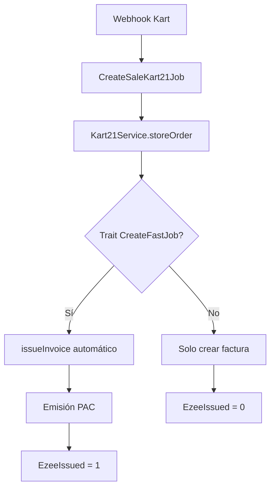

# Diagnóstico y Reparación: Kart → Facturación Electrónica

Este sistema de diagnóstico está diseñado para identificar y resolver problemas cuando las órdenes de Kart21 no se emiten automáticamente como facturas electrónicas en DocuCenter.

## Caso de Uso: Orden Kart #12720

### Datos de la Orden Problemática

```json
{
  "id": 12720,
  "number": "12720",
  "status": "CLOSED",
  "customer": {
    "name": "Marcos Bohnen",
    "email": "marcos.bohnen@gmail.com"
  },
  "items": [
    {
      "product_name": "Promo Vacaciones",
      "price": 19.00,
      "tax": 1.33
    },
    {
      "product_name": "Licencia por 1 dia",
      "price": 0.00,
      "tax": 0.00
    }
  ],
  "total": 20.33
}
```

## Herramientas de Diagnóstico

### 1. Script Principal de Diagnóstico

```bash
./scripts/diagnose-kart-invoice.sh diagnose <org_id> [kart_order_id]
```

**Funcionalidades:**
- Verificación de configuración PAC
- Búsqueda de facturas en el sistema
-  Análisis de logs de procesamiento
- 🧪 Simulación de procesamiento
-  Estado de jobs en cola
- Recomendaciones de solución

### 2. Comandos Artisan Específicos

#### Diagnóstico Completo
```bash
php artisan kart:diagnose-invoice <organization_id> [kart_order_id]
```

#### Forzar Emisión
```bash
php artisan kart:force-emission <organization_id> [invoice_id] [--all] [--dry-run]
```

## Proceso de Diagnóstico

### Paso 1: Verificación de Configuración

```bash
./scripts/diagnose-kart-invoice.sh diagnose 1 12720
```

**Verifica:**
- Organización existe
- Configuración PAC activa
- Token PAC válido
- Base de datos específica

### Paso 2: Búsqueda de Factura

**Criterios de búsqueda:**
- InvoiceNumber contiene ID de orden
- CustomerName contiene "Marcos" o "Bohnen"
- Total coincide ($20.33)
- Fecha de la transacción

### Paso 3: Análisis de Logs

**Patrones buscados:**
- `CreateSaleKart21Job`
- `Kart21Service`
- `storeOrder`
- Errores relacionados

### Paso 4: Verificación de Emisión Automática

**Verifica si:**
- Kart21Service tiene trait `CreateFastJob`
- Método `issueInvoice` está disponible
- Configuración PAC permite emisión
- Factura ya fue emitida (`EzeeIssued = 1`)

## Soluciones Comunes

### Problema 1: No hay configuración PAC

**Síntomas:**
- Error: "No se encontró configuración PAC"
- Facturas se crean pero no se emiten

**Solución:**
```bash
# 1. Configurar PAC en panel de administración
# 2. Verificar endpoint y token
# 3. Activar la conexión PAC
```

### Problema 2: Kart21Service sin emisión automática

**Síntomas:**
- Factura se crea en DocuCenter
- No se emite automáticamente
- `EzeeIssued = 0`

**Solución:**
```php
// Agregar trait CreateFastJob a Kart21Service
class Kart21Service implements Kart21ServiceContract
{
    use Helper, CreateFastJob;
    
    // ... resto del código
}
```

### Problema 3: Webhook no llegó correctamente

**Síntomas:**
- No hay factura en DocuCenter
- No hay logs de procesamiento
- Job no se ejecutó

**Solución:**
```bash
# Simular procesamiento manual
./scripts/diagnose-kart-invoice.sh simulate 1

# O procesar directamente
php artisan kart:send-to-zoho 21 --dry-run
```

### Problema 4: Job falló en procesamiento

**Síntomas:**
- Jobs en estado failed
- Logs con errores de excepción
- Factura parcialmente creada

**Solución:**
```bash
# Ver jobs fallidos
php artisan queue:failed

# Reintentar jobs específicos
php artisan queue:retry <job_id>

# Forzar emisión de factura existente
./scripts/diagnose-kart-invoice.sh force-emit 1 123
```

## Ejemplos de Uso

### Diagnóstico Completo
```bash
# Diagnosticar orden específica
./scripts/diagnose-kart-invoice.sh diagnose 1 12720

# Diagnosticar configuración general
./scripts/diagnose-kart-invoice.sh diagnose 1
```

### Forzar Emisión
```bash
# Ver qué facturas se emitirían (dry-run)
./scripts/diagnose-kart-invoice.sh force-emit-all 1 --dry-run

# Emitir factura específica
./scripts/diagnose-kart-invoice.sh force-emit 1 123

# Emitir todas las pendientes
./scripts/diagnose-kart-invoice.sh force-emit-all 1
```

### Revisión de Logs
```bash
# Logs específicos de una orden
./scripts/diagnose-kart-invoice.sh check-logs 12720

# Estado de la cola
./scripts/diagnose-kart-invoice.sh queue-status
```

### Simulación con Datos de Prueba
```bash
# Procesar orden problemática con datos reales
./scripts/diagnose-kart-invoice.sh simulate 1
```

## Flujo de Procesamiento Normal



## Implementación de Emisión Automática

Para habilitar emisión automática en Kart21Service:

```php
<?php

namespace App\Services;

use App\Traits\CreateFastJob;
use App\Contracts\Kart21ServiceContract;
// ... otros imports

class Kart21Service implements Kart21ServiceContract
{
    use Helper, CreateFastJob; // Agregar el trait
    
    // ... resto del código existente
    
    /**
     * Método requerido por CreateFastJob para emisión automática
     */
    public function issueInvoice($salesHeader, $user)
    {
        // Implementación específica para Kart21
        return $this->processEmission($salesHeader, $user);
    }
}
```

## Checklist de Verificación

### Pre-requisitos
- [ ] Organización configurada
- [ ] Conexión PAC activa
- [ ] Token PAC válido
- [ ] Endpoint PAC correcto

### Procesamiento
- [ ] Webhook recibido correctamente
- [ ] Job CreateSaleKart21Job ejecutado
- [ ] Factura creada en DocuCenter
- [ ] Cliente asociado correctamente

### Emisión
- [ ] Trait CreateFastJob implementado
- [ ] Método issueInvoice disponible
- [ ] Emisión PAC exitosa
- [ ] EzeeIssued = 1

## 🆘 Soporte y Troubleshooting

### Logs Importantes
```bash
# Logs generales
tail -f storage/logs/laravel.log | grep -i 'kart\|CreateSaleKart21Job'

# Logs de cola
tail -f storage/logs/queue.log
```

### Comandos de Diagnóstico
```bash
# Estado completo del sistema
./scripts/diagnose-kart-invoice.sh diagnose 1

# Verificar cola de jobs
php artisan queue:size
php artisan queue:failed

# Procesar cola manualmente
php artisan queue:work --once
```

### Contacto de Soporte
- **Documentación**: `docs/api/fe/kart21-api.md`
- **Testing**: `docs/testing/kart21-service-analysis.md`
- **Código**: `app/Services/Kart21Service.php`

---

## Casos de Uso Específicos

### Caso 1: Orden #12720 no se emitió
```bash
./scripts/diagnose-kart-invoice.sh diagnose 1 12720
```

### Caso 2: Cliente reporta factura faltante
```bash
./scripts/diagnose-kart-invoice.sh diagnose 1
./scripts/diagnose-kart-invoice.sh force-emit-all 1 --dry-run
```

### Caso 3: Múltiples órdenes sin emitir
```bash
./scripts/diagnose-kart-invoice.sh force-emit-all 1
```

Este sistema proporciona una solución completa para diagnosticar y resolver problemas de facturación electrónica con Kart21, asegurando que todas las transacciones se procesen correctamente según las normativas fiscales panameñas.
